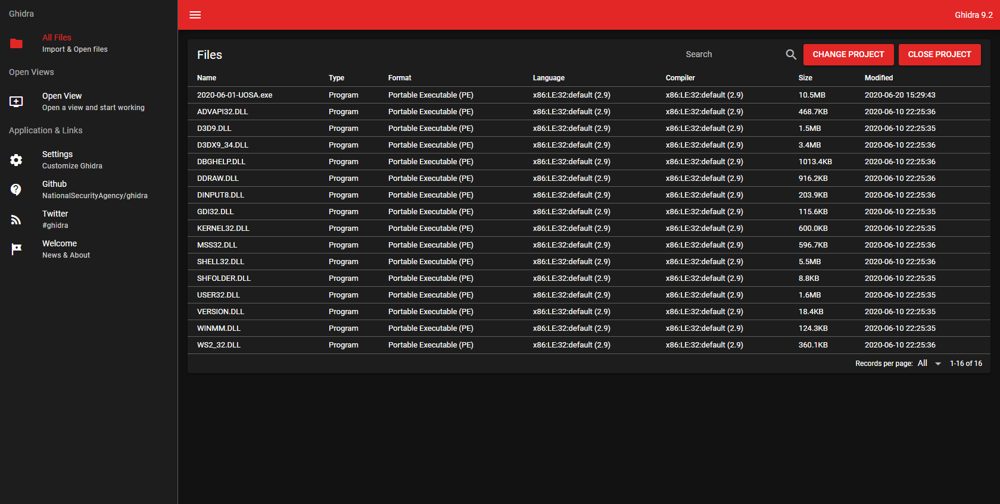

# Ghidra Frontend

A modern HTML5 UI for Ghidra. Build with Vue.js.

I started working on this in January 2021 as a proof of concept. There is way more still to do than is done yet ;)

It also needs a [Ghidra Web API server](https://github.com/yetmorecode/ghidra-rest).

## Features

* Open Projects and show project files

## Next Todos

* Open Programs
* Close Programs
* Show Program datatypes
* Show program functions

## Development

[Ghidra Frontend Development Guide](doc/development.md)
